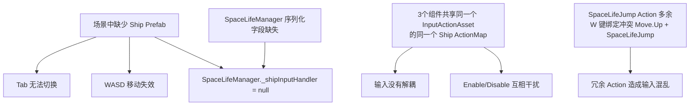

# 需求文档 — SpaceLife 模块 Bug 修复与架构清理

## 引言

### 背景

SpaceLife（太空生活）模块是 Project Ark 的核心休闲系统，允许玩家在战斗间隙通过 Tab 键切换到飞船内部，以 2D 视角探索、与 NPC 互动。SpaceLife 角色使用 **4 方向移动（WASD / 上下左右）**，不需要跳跃功能。

经过全面排查，发现该模块存在 **3 大核心 Bug** 和 **多项架构隐患**，根本原因可追溯到以下几点：

### 问题总览

| # | 严重度 | 问题描述 | 根因 |
|---|--------|---------|------|
| B1 | 🔴 Critical | 按 Tab 无法进入 SpaceLife | 场景中**没有 Ship Prefab 实例**，`ServiceLocator.Get<InputHandler>()` 返回 null，SpaceLifeManager 无法订阅 `OnToggleSpaceLifePerformed` 事件 |
| B2 | 🔴 Critical | 飞船 WASD 移动失效 | 同 B1 — Ship Prefab 不在场景中，`ShipMotor` 和 `InputHandler` 都不存在，自然没有移动 |
| B3 | 🟡 Design | 飞船控制与 SpaceLife 角色控制没有完全解耦 | Ship InputHandler、SpaceLifeInputHandler、PlayerController2D 共享同一个 `InputActionAsset` 的同一个 `Ship` ActionMap，Enable/Disable 互相干扰 |
| B4 | 🟠 High | SpaceLifeManager 场景序列化缺失大量引用 | `_spaceLifePlayerPrefab`、`_mainCamera`、`_shipRoot`、`_spaceLifeInputHandler` 均为 null/0 |
| B5 | 🟡 Medium | SpaceLifeJump Action 多余且与 Move.Up 冲突 | SpaceLife 不需要跳跃功能，但 W 键同时绑定到 `Move.Up` 和 `SpaceLifeJump`，造成冗余和潜在冲突 |
| B6 | 🟡 Medium | `SpaceLifeInputHandler.OnEnable` 会重新 Enable 整个 `Ship` ActionMap | 当 SpaceLife 退出后 Ship InputHandler.OnDisable 也会 Disable 整个 ActionMap，如果执行顺序不对会导致输入丢失 |

### 根因分析图



---

## 需求

### 需求 1：修复场景中缺失的 Ship Prefab 实例（修复 B1 + B2）

**用户故事：** 作为玩家，我希望游戏启动后飞船正常出现在场景中且能用 WASD 控制移动，以便正常游玩战斗关卡。

#### 验收标准

1. WHEN 打开 `SampleScene` 并进入 Play Mode THEN 场景中 SHALL 存在一个 Ship Prefab 实例（包含 `InputHandler`、`ShipMotor`、`ShipAiming` 组件），且 Console 中不出现 `[ServiceLocator] Get: InputHandler = NOT FOUND` 错误
2. WHEN 按 WASD 键 THEN 飞船 SHALL 正常响应移动输入，速度和手感与 `DefaultShipStats` SO 中配置的参数一致
3. WHEN 按 Tab 键 THEN SpaceLifeManager SHALL 接收到 `OnToggleSpaceLifePerformed` 事件并执行视角切换
4. IF Ship Prefab 已经通过其他方式实例化（如 GameManager 动态生成）THEN 代码中 SHALL 有防御性检查确保不重复创建

> **实施提示：** 这可能是用户在编辑器中手动删除了 Ship 实例或从未拖入场景。需要确认 Ship 的生命周期管理方式（静态放置 vs 运行时 Spawn），然后修复场景或添加自动化保障。

### 需求 2：修复 SpaceLifeManager 序列化引用缺失（修复 B4）

**用户故事：** 作为关卡策划，我希望 SpaceLifeManager 的所有序列化字段都被正确配置，以便 Tab 切换能正常执行完整的视角转换流程。

#### 验收标准

1. WHEN 检查 SampleScene 中 SpaceLifeManager 组件 THEN 以下字段 SHALL NOT 为 null：
   - `_spaceLifePlayerPrefab` → 引用 `Assets/_Prefabs/SpaceLife/Player2D_Prefab.prefab`
   - `_spaceLifeSpawnPoint` → 引用场景中的 SpawnPoint Transform
   - `_spaceLifeCamera` → 引用场景中的 SpaceLife Camera
   - `_mainCamera` → 引用场景中的 Main Camera（或在运行时通过 `Camera.main` 自动获取）
   - `_spaceLifeSceneRoot` → 引用 SpaceLife 场景根对象
   - `_shipRoot` → 引用 Ship GameObject（或在运行时通过 ServiceLocator 获取）
   - `_spaceLifeInputHandler` → 引用场景中的 SpaceLifeInputHandler 组件
2. WHEN 进入 Play Mode THEN Console 中 SHALL NOT 出现任何关于 SpaceLifeManager 字段为 null 的错误日志
3. IF 某个字段在编辑时无法提前配置（如 Ship 是动态生成的）THEN SpaceLifeManager.Start() SHALL 通过 ServiceLocator 或其他方式自动获取，并在获取失败时打印有意义的错误提示

### 需求 3：输入系统解耦 — 分离 Ship 和 SpaceLife 的 ActionMap（修复 B3 + B6）

**用户故事：** 作为开发者，我希望飞船的输入控制和 SpaceLife 角色的输入控制使用**独立的 ActionMap**（或独立的 InputActionAsset 实例），以便两者的 Enable/Disable 互不影响，不会因为禁用飞船输入而意外断开 SpaceLife 输入。

#### 验收标准

1. WHEN SpaceLife 模式激活时 THEN Ship 的输入处理 SHALL 完全禁用，SpaceLife 的输入处理 SHALL 独立启用，**不依赖于 Ship ActionMap 的状态**
2. WHEN SpaceLife 模式退出时 THEN SpaceLife 输入处理 SHALL 完全禁用，Ship 输入处理 SHALL 独立重新启用
3. WHEN Ship InputHandler.OnDisable() 被调用 THEN 它 SHALL NOT 影响 SpaceLife 组件读取 Move/ToggleSpaceLife 等 Action 的能力
4. WHEN SpaceLifeInputHandler.OnDisable() 被调用 THEN 它 SHALL NOT 影响 Ship InputHandler 读取 Move/Fire/Aim 等 Action 的能力

> **实施建议（两种方案择一）：**
>
> **方案 A — 添加 SpaceLife ActionMap（推荐）：**
> 在 `ShipActions.inputactions` 中新增一个 `SpaceLife` ActionMap，包含 SpaceLife 专用的 Move（4方向 WASD）、Interact、ToggleSpaceLife Action。**不包含 Jump Action**（SpaceLife 不需要跳跃）。SpaceLifeInputHandler 和 PlayerController2D 使用 `SpaceLife` Map 而非 `Ship` Map。ToggleSpaceLife 在两个 Map 中都存在（保证两种模式都能切 Tab）。
>
> **方案 B — 克隆 InputActionAsset 实例：**
> SpaceLife 组件在 Awake 时 `Instantiate(_inputActions)` 创建独立实例，避免共享状态。但这种方案更隐蔽，不易调试。

### 需求 4：移除多余的 SpaceLifeJump Action（修复 B5）

**用户故事：** 作为开发者，我希望 InputActionAsset 中不存在冗余的 Action 定义，以便减少输入绑定冲突和维护负担。

#### 验收标准

1. WHEN 审查 `ShipActions.inputactions` THEN `SpaceLifeJump` Action SHALL 被移除（SpaceLife 使用 4 方向移动，不需要跳跃功能）
2. WHEN 审查 `SpaceLifeInputHandler.cs` THEN 所有引用 `SpaceLifeJump` Action 的代码 SHALL 被移除（包括事件订阅、回调方法、公开属性等）
3. IF 使用方案 A（新增 SpaceLife ActionMap）THEN SpaceLife ActionMap 中的 Move Action SHALL 绑定完整的 4 方向（WASD + 方向键），与 Ship ActionMap 的 Move 绑定保持一致
4. WHEN 在 SpaceLife 模式下按 WASD 键 THEN 角色 SHALL 进行 4 方向移动（上下左右），行为与 PlayerController2D 当前实现一致（保持 4 方向移动逻辑不变）
5. WHEN 在 Ship 模式下按 WASD 键 THEN 飞船 SHALL 正常进行 4 方向移动（不受 SpaceLife 相关修改影响）

### 需求 5：增强 SpaceLifeManager 的防御性和健壮性

**用户故事：** 作为开发者，我希望 SpaceLifeManager 在缺少依赖时能优雅降级并给出清晰的错误信息，而不是默默失败让人排查半天。

#### 验收标准

1. WHEN SpaceLifeManager.Start() 中任何通过 ServiceLocator 获取的依赖为 null THEN 系统 SHALL 打印包含 **具体缺失组件名称** 和 **修复建议** 的错误日志（如：`[SpaceLifeManager] CRITICAL: InputHandler not found via ServiceLocator. Ensure Ship Prefab is in scene and has InputHandler component.`）
2. WHEN `_spaceLifePlayerPrefab` 为 null 时尝试 EnterSpaceLife THEN 系统 SHALL 打印错误并 **不执行切换**（当前已有此逻辑但在 SpawnPlayer 中，应提前到 EnterSpaceLife 入口处检查）
3. WHEN `ToggleSpaceLife()` 被调用但前置条件不满足（如缺少 Player Prefab）THEN 系统 SHALL 打印具体原因而非静默忽略
4. IF SpaceLifeManager 的 `_shipInputHandler` 在 Start 时为 null THEN 系统 SHALL 尝试通过 `FindFirstObjectByType<InputHandler>()` 作为 fallback，并在找到时打印 Warning

### 需求 6：SpaceLife Editor 工具增强 — 场景健康检查

**用户故事：** 作为关卡策划，我希望 SpaceLife Setup Wizard 能在设置时自动检测并修复场景中所有缺失的依赖（包括 Ship Prefab），以便一键恢复到可运行状态。

#### 验收标准

1. WHEN 打开 SpaceLife Setup Wizard THEN 状态面板 SHALL 显示以下关键组件的存在状态：
   - ✅/❌ Ship Prefab 实例
   - ✅/❌ Ship InputHandler 组件
   - ✅/❌ SpaceLifeManager（及其各个序列化引用的状态）
   - ✅/❌ SpaceLifeInputHandler
   - ✅/❌ SpaceLifeCamera
   - ✅/❌ SpaceLifeSceneRoot
   - ✅/❌ Player2D Prefab 存在
2. WHEN 检测到 Ship Prefab 实例缺失 THEN Setup Wizard SHALL 提供 **"添加 Ship 到场景"** 按钮，点击后从 `Assets/_Prefabs/Ship/Ship.prefab` 实例化到场景中
3. WHEN 检测到 SpaceLifeManager 的序列化引用缺失 THEN Setup Wizard SHALL 提供 **"Auto-Wire References"** 按钮，自动查找并填充所有可自动推导的引用

---

## 附录

### A. 场景序列化现状（SampleScene.unity）

**SpaceLifeManager 序列化字段：**
```
_spaceLifePlayerPrefab: {fileID: 0}           ← ❌ 空！
_spaceLifeSpawnPoint: {fileID: 1166631374}     ← ✅ 有引用
_spaceLifeCamera: {fileID: 1325000979}         ← ✅ 有引用
_mainCamera: {fileID: 0}                       ← ❌ 空！
_spaceLifeSceneRoot: {fileID: 359918692}       ← ✅ 有引用
_shipRoot: {fileID: 0}                         ← ❌ 空！
_spaceLifeInputHandler: 缺失                   ← ❌ 字段未序列化（可能后添加的字段）
_isInSpaceLifeMode: 0                          ← ✅ 正常
```

**Ship Prefab 实例：**
- ❌ 不存在于 SampleScene 中（搜索 InputHandler GUID、Ship prefab 引用、m_Name 均无结果）
- Ship Prefab 定义在 `Assets/_Prefabs/Ship/Ship.prefab`（包含 InputHandler + ShipMotor + ShipAiming）

**SpaceLifeInputHandler：**
- ✅ 存在于场景中（fileID: 1053626872），但 SpaceLifeManager 没有引用它

### B. InputActionAsset 共享冲突分析

```
ShipActions.inputactions
└── Ship ActionMap ← 被 3 个组件共享！
    ├── Ship.InputHandler     → OnEnable: Enable map → OnDisable: Disable map
    ├── SpaceLifeInputHandler → OnEnable: Enable map → OnDisable: Disable action
    └── PlayerController2D    → OnEnable: Enable map → OnDisable: Disable action

问题：当 SpaceLifeManager.EnterSpaceLife() 执行 `_shipInputHandler.enabled = false` 时，
Ship.InputHandler.OnDisable() 会调用 `shipMap.Disable()`，
此时如果 PlayerController2D.OnEnable() 还没执行，PlayerController2D 获取到的 Ship Map 是 disabled 状态。
虽然 PlayerController2D.OnEnable 中有 `if (!shipMap.enabled) shipMap.Enable()` 的防护，
但这依赖于 **Unity 组件启用顺序**，非常脆弱。
```

### C. SpaceLifeJump 冗余分析

```
Ship ActionMap 中的绑定：
  Move.Up         → Keyboard/w    (2DVector Composite part)
  SpaceLifeJump   → Keyboard/w    (standalone binding)

SpaceLife 的设计确认：
  - 角色使用 4 方向移动（WASD / 上下左右），与飞船移动方式一致
  - 不需要跳跃功能
  - SpaceLifeJump Action 完全多余，应当移除

W 键冲突的影响：
  - 虽然 SpaceLife 不使用 Jump，但 SpaceLifeJump 的存在仍会在 InputSystem 中
    消耗 W 键的按键事件，如果有任何代码订阅了该 Action 的回调，
    将产生不必要的副作用
  - 移除 SpaceLifeJump 后，W 键仅触发 Move.Up，行为干净无歧义
```
