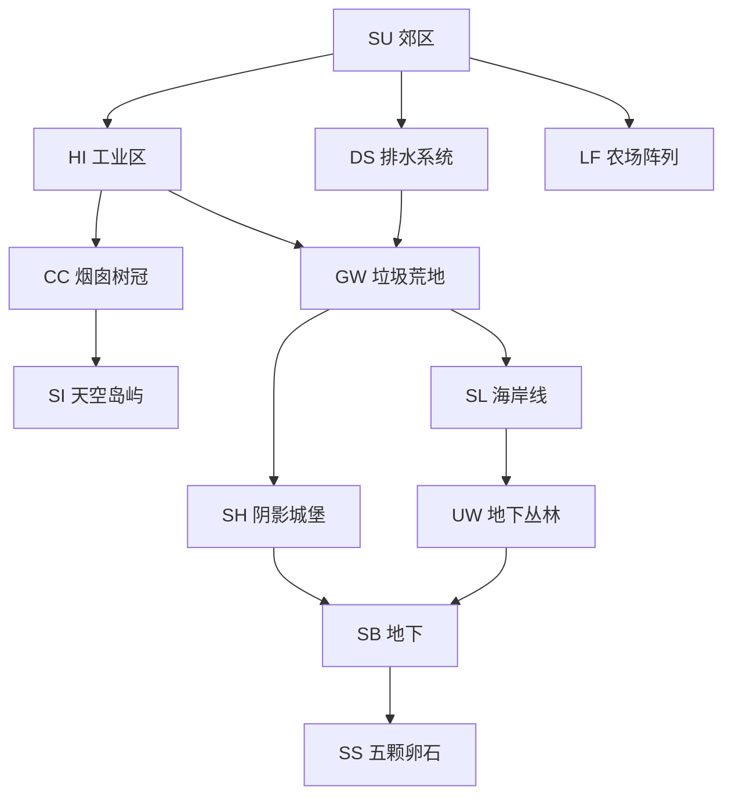

# Rain World — 完整项目结构分析

> **分析日期**：2026-03-08  
> **Unity 版本**：2021.3.x（Mono 构建）  
> **构建类型**：**Mono**（`RainWorld_Data/Managed/Assembly-CSharp.dll` 可直接反编译）  
> **渲染框架**：**Futile**（自定义 2D 渲染器，非 Unity 标准 SpriteRenderer）  
> **输入系统**：**Rewired**（第三方输入库）  
> **补间库**：**GoKit**（轻量补间，非 DOTween）  
> **模组框架**：**BepInEx**（活跃的模组社区）  
> **源文件路径**：`F:\SteamLibrary\steamapps\common\Rain World\`

---

## 一、项目概览

Rain World 是一款**生态模拟 × 平台动作**游戏。玩家扮演 Slugcat（蛞蝓猫），在一个有完整食物链的程序化生态系统中生存。游戏最核心的设计哲学是：**玩家不是世界的主角，只是食物链中的一环**。

### 核心数字

| 类别 | 数量 |
|------|------|
| C# 类型（Assembly-CSharp.dll） | ~11,729 个符号 |
| 生物 AI 类 | 70+ 个独立 AI 类 |
| 着色器 | **313 个** .shader 文件 |
| 音效 | **1,620 个** .wav 文件 |
| 程序化音乐片段 | **269 个** .ogg 文件 |
| 完整音乐曲目 | **267 个** .mp3/.ogg 文件 |
| 关卡文件 | **174 个** 竞技场关卡 |
| 世界区域 | **12 个** 主要区域（SU/CC/DS/HI/GW/SI/SH/SL/LF/UW/SB/SS） |
| 调色板 | **54 个** 调色板 PNG |
| 插图 | **251 张** 过场插图 |
| 贴花 | **265 个** 贴花 PNG |

---

## 二、架构总览：Rain World 的独特性

Rain World 是一个**极度反 Unity 惯例**的项目：

```
标准 Unity 游戏：
  Unity GameObject/Component → SpriteRenderer → Physics2D → Animator → AssetBundle

Rain World：
  自定义 PhysicalObject（BodyChunk 数组）→ Futile FSprite → 手写物理 → 程序化动画 → StreamingAssets 文本文件
```

**关键架构决策**：
1. **不用 Unity 物理**：自己实现 `SharedPhysics`，基于 `BodyChunk` 数组的弹簧-质点系统
2. **不用 Unity 动画**：所有生物动画完全程序化（IK + 弹簧 + 噪声）
3. **不用 Unity 渲染**：Futile 框架，手动管理 Mesh/Atlas/Batch
4. **不用 AssetBundle**：所有关卡数据是 StreamingAssets 里的纯文本文件
5. **不用 ScriptableObject**：数据全部硬编码或从文本文件解析

---

## 三、代码架构

### 3.1 实体系统（PhysicalObject）

```
AbstractPhysicalObject          ← 抽象层（存档/世界图中的引用）
└── PhysicalObject              ← 物理实体基类
    ├── BodyChunk[]             ← 质点数组（每个生物由多个 BodyChunk 组成）
    ├── BodyChunkConnection[]   ← 质点间约束（弹簧/刚性/铰链）
    ├── IDrawable               ← 渲染接口
    └── Creature                ← 生物基类
        ├── Player              ← 玩家（Slugcat）
        ├── Lizard              ← 蜥蜴（多种颜色变体）
        ├── Vulture             ← 秃鹫
        ├── Centipede           ← 蜈蚣
        ├── BigSpider           ← 大蜘蛛
        ├── Scavenger           ← 拾荒者（有社会系统）
        ├── Overseer            ← 监视者（Oracle 的眼睛）
        └── ... (70+ 种生物)
```

### 3.2 物理系统（SharedPhysics）

Rain World 的物理是**完全自定义**的，不依赖 Unity Physics2D：

```csharp
// BodyChunk 核心结构（推断）
class BodyChunk {
    Vector2 pos;          // 当前位置
    Vector2 lastPos;      // 上一帧位置（Verlet 积分）
    Vector2 vel;          // 速度
    float rad;            // 碰撞半径
    float mass;           // 质量
    float surfaceFriction; // 表面摩擦
    float airFriction;    // 空气阻力
    bool onGround;        // 是否在地面
}

// BodyChunkConnection 约束类型
enum Type { Push, Pull, Hinge, Rigid }
```

**Verlet 积分**：`vel = pos - lastPos`，每帧 `pos += vel`，然后解算约束。

**碰撞检测**：基于 Room 的 Tile 网格（每个 Tile 20×20 像素），`SharedPhysics.RayTraceTilesForTerrainType()` 做射线检测。

### 3.3 程序化动画系统

Rain World 的所有生物动画**完全程序化**，没有任何 Animator/AnimationClip：

```
生物动画架构：
  Creature.graphicsModule → [CreatureType]Graphics
    ├── 骨骼链（Limb/Appendage 数组）
    ├── IK 求解（从 BodyChunk 位置反向求解肢体角度）
    ├── 弹簧阻尼（肢体跟随身体的弹性延迟）
    ├── 噪声扰动（Perlin Noise 驱动的自然抖动）
    └── 状态混合（行走/奔跑/攀爬/游泳 的 IK 目标切换）
```

**已确认的 Graphics 类（每种生物独立实现）**：
`AnglerGraphics`, `BarnacleGraphics`, `BigEelGraphics`, `BigMothGraphics`, `BigSpiderGraphics`, `CentipedeGraphics`, `CicadaGraphics`, `DaddyGraphics`, `DeerGraphics`, `DrillCrabGraphics`, `DropBugGraphics`, `EggBugGraphics`, `FlyGraphics`, `FrogGraphics`, `GarbageWormGraphics`, `GrappleSnakeGraphics`, `HazerGraphics`, `InspectorGraphics`, `JetFishGraphics`, `LizardGraphics`, `MirosBirdGraphics`, `OverseerGraphics`, `PlayerGraphics`, `ScavengerGraphics`, `SlugNPCGraphics`, `SnailGraphics`, `SpiderGraphics`, `TentaclePlantGraphics`, `TubeWormGraphics`, `VultureGraphics`...

### 3.4 AI 系统（双层架构）

每种生物有两个 AI 类：

```
AbstractCreatureAI      ← 世界层 AI（生物不在当前房间时的抽象行为）
└── [Creature]AI        ← 实体层 AI（生物在当前房间时的完整 AI）
    ├── Tracker         ← 感知系统（视觉/听觉/嗅觉追踪）
    ├── Behavior        ← 当前行为状态
    ├── Relationships   ← 与其他生物的关系
    └── PathFinder      ← 寻路（基于 Room 的 Tile 图）
```

**已确认的 AI 类（70+ 种）**：
`AnglerAI`, `BarnacleAI`, `BigEelAI`, `BigMothAI`, `BigNeedleWormAI`, `BigSpiderAI`, `BoxWormAI`, `CentipedeAI`, `CicadaAI`, `DaddyAI`, `DeerAI`, `DrillCrabAI`, `DropBugAI`, `EggBugAI`, `FireSpriteAI`, `FlyAI`, `FrogAI`, `GarbageWormAI`, `GrappleSnakeAI`, `InspectorAI`, `JetFishAI`, `LizardAI`, `LoachAI`, `MillipedeAI`, `MirosBirdAI`, `MothGrubAI`, `MouseAI`, `OverseerAI`, `RatAI`, `RattlerAI`, `RippleSpiderAI`, `RotAI`, `SandGrubAI`, `ScavengerAI`, `SkyWhaleAI`, `SlugNPCAI`, `SmallNeedleWormAI`, `SnailAI`, `StowawayBugAI`, `TardigradeAI`, `TempleGuardAI`, `TentaclePlantAI`, `TubeWormAI`, `VultureAI`, `YeekAI`...

**世界层 AI（跨房间调度）**：
- `FliesWorldAI`：蝙蝠群的全局迁徙调度
- `ScavengersWorldAI`：拾荒者部落的全局行为
- `OverseersWorldAI`：监视者的全局分配
- `VoidSpawnWorldAI`：虚空生物的全局行为

### 3.5 社会关系系统（Relationship）

Rain World 有一套完整的**生物间社会关系系统**：

```csharp
// CreatureRelationship（推断）
struct CreatureRelationship {
    Type type;      // Afraid / Attacks / Eats / Ignores / Uncomfortable / StayOutOfWay / AgressiveRival / Pack
    float intensity; // 关系强度 0-1
}

// 关系类型决定行为
// Scavenger 有 Pack 系统：FindPackLeader / PackMemberEncounter / PackMemberIsSeeingCreature
// 蜥蜴有 Dominance 系统：领地争夺
```

**静态关系表**：`InitStaticWorldRelationships()` 在游戏启动时初始化所有物种间的默认关系（谁吃谁、谁怕谁）。

**动态关系**：`EstablishDynamicRelationship()` 在运行时根据遭遇历史修改关系（Scavenger 记住伤害过它的玩家）。

### 3.6 LINEAGE 系统（程序化生物进化）

这是 Rain World 最独特的设计之一：

```
// world_su.txt 中的 LINEAGE 定义
LINEAGE : SU_A31 : 3 : NONE-0.1, Small Centipede-1.0, Centipede-{0.3}-1.0, Centipede-{0.5}-1.0, Centipede-{0.7}-0

// 格式：LINEAGE : 房间ID : 生成槽位 : 物种-概率, 物种-{参数}-概率, ...
// 含义：SU_A31 房间的第3个生成槽，每个周期随机从列表中选择一种生物生成
// {0.3} 等参数是生物的体型/强度参数
```

**LINEAGE 机制**：
- 每个 `LINEAGE` 条目定义一个**生成槽的进化链**
- 每个游戏周期（Rain Cycle）结束后，该槽位的生物会根据概率权重**重新随机选择**
- 这意味着同一个房间在不同周期可能出现不同的生物
- 玩家无法预测下一个周期会遇到什么，增加了探索的不确定性

### 3.7 世界图系统（World Graph）

```
// world_su.txt 格式
ROOMS
SU_A33 : SU_B13, SU_B04, SU_A20          ← 房间连接图（邻接表）
SU_S04 : SU_A37 : SHELTER                 ← 特殊标记（庇护所）
SU_A40 : SU_A17, SU_B07 : SWARMROOM      ← 蝙蝠群房间
SU_C02 : SU_A45, SU_A07 : SCAVOUTPOST    ← 拾荒者哨站
GATE_SU_DS : SU_B14, DISCONNECTED : GATE ← 区域门
END ROOMS

CREATURES
SU_B11 : 4-CicadaB, 5-CicadaA            ← 固定生物（槽位-物种）
LINEAGE : SU_A31 : 3 : ...               ← 进化链生物
(White)SU_C02 : 5-Pink, 2-BigNeedleWorm  ← 特定角色专属生物
END CREATURES
```

**Room_Attr 系统**（`properties.txt`）：
```
Room_Attr: SU_B04: PinkLizard-Like, GreenLizard-Like, Vulture-Avoid, ...
// 每个房间对每种生物有偏好标记：Like/Avoid/Forbidden/Stay
// AI 的寻路权重会受到这些标记影响
// 这是设计师控制生态分布的主要工具
```

### 3.8 Rain Cycle（游戏时间系统）

```
RainCycle（推断）：
  ├── 每个周期有固定时长（约 5-8 分钟）
  ├── 周期结束时开始下雨（致命的洪水）
  ├── 玩家必须在雨前到达 Shelter（庇护所）
  ├── 周期结束后：
  │   ├── 所有死亡生物重生（LINEAGE 重新随机）
  │   ├── 玩家 Karma 根据行为变化
  │   └── 世界状态更新（Scavenger 记忆/蝙蝠群迁徙）
  └── CycleCompleted / AllowRainCounterToTick / CalmBeforeStorm
```

### 3.9 Karma 系统

```
Karma（业力）：
  ├── 1-10 级，影响能否通过 Karma Gate（区域门）
  ├── 吃食物/到达庇护所 → Karma 上升
  ├── 死亡 → Karma 下降
  ├── 特殊行为（帮助生物/冥想）→ 特殊 Karma 变化
  └── KarmaFlower：可以锁定当前 Karma 不因死亡下降
```

### 3.10 Futile 渲染框架

Rain World 使用 **Futile**（一个开源的 Unity 2D 渲染框架，类似 Cocos2D 风格）：

```
Futile 核心类：
  FStage          ← 场景根节点（类似 DisplayList）
  FNode           ← 所有可渲染对象的基类
  FSprite         ← 精灵（从 FAtlas 取 UV）
  FContainer      ← 容器节点（类似 DisplayObjectContainer）
  FLabel          ← 文字标签
  FAtlas          ← 纹理图集（手动管理 UV）
  FAtlasManager   ← 图集管理器
  FShader         ← 着色器包装
  FSoundManager   ← 音效管理
  FRenderLayer    ← 渲染层（手动控制绘制顺序）
```

**Futile 的优势**：完全控制渲染批次，可以精确控制每个 Sprite 的深度和混合模式，适合 Rain World 这种需要大量自定义着色器效果的游戏。

---

## 四、程序化世界系统（重点）

### 4.1 房间文件格式

```
// su_a01.txt 格式解析
SU_A01              ← 房间 ID
48*35|-1|0          ← 宽*高 | 调色板ID | 环境类型
4.2252*7.9465|0|0   ← 摄像机位置 | 摄像机模式 | 摄像机缩放
-220,-30            ← 玩家出生偏移
Border: Passable    ← 边界类型（Passable/Solid/Deadly）

[空行 = 层分隔]

[Tile 数据]         ← 每个 Tile 的地形类型编码（压缩格式）
[对象数据]          ← 房间内的放置对象（管道/门/装饰等）
[效果数据]          ← 视觉效果（雾/粒子/光照等）
```

**Tile 类型**：
- `0` = 空气
- `1` = 实心墙
- `2` = 斜坡（左上/右上/左下/右下）
- `3` = 平台（可穿越）
- `4` = 快捷通道入口（Shortcut）

### 4.2 调色板系统（Palette）

Rain World 的视觉风格完全由**调色板驱动**：

```
palettes/
├── palette0.png ~ palette35.png  ← 主调色板（每个区域有专属调色板）
├── effectcolors.png              ← 效果颜色（雨/雾/光照）
├── noise.png / noise2.png        ← 噪声纹理（用于着色器）
├── citypalette.png               ← 城市区域专用调色板
└── terrainpalettes/              ← 地形专用调色板（41个）
```

**调色板工作原理**：
- 所有 Sprite 使用**灰度纹理**（不含颜色信息）
- 着色器在运行时从调色板 PNG 采样颜色
- 通过修改调色板可以实现区域主题切换（白天/黑夜/不同区域）
- `ApplyPalette()` / `ApplyEffectColorsToPaletteTexture()` 负责调色板切换

### 4.3 着色器系统（313 个 Shader）

Rain World 有 **313 个自定义着色器**，这是其视觉风格的核心：

**分类**：
| 类别 | 代表 Shader | 用途 |
|------|-------------|------|
| 基础渲染 | `Basic.shader`, `Additive.shader` | Futile 基础渲染 |
| 生物专用 | `AquapedeBody.shader`, `BigSkyWhaleBaleen.shader` | 每种生物独立着色器 |
| 环境效果 | `Aurora.shader`, `AetherRainbow.shader`, `Background.shader` | 背景/天气效果 |
| 地形 | `BackgroundDune.shader`, `AncientUrbanBuilding.shader` | 区域特定地形 |
| 后处理 | `Adrenaline.shader` | 肾上腺素视觉效果 |
| 粒子 | `BulletRain.shader` | 雨滴粒子 |

### 4.4 程序化音乐系统（ProceduralMusic）

```
music/
├── procedural/   ← 269 个片段（SU_1.ogg ~ SU_5.ogg 等，按区域分组）
└── songs/        ← 267 个完整曲目（BM_CC_CANOPY.mp3 等）
```

**程序化音乐架构**：
- `ProceduralMusic` + `ProceduralMusicInstruction` 类
- 每个区域有多个音乐片段（如 SU 区域有 SU_1 ~ SU_5）
- 根据游戏状态（危险程度/区域/时间）动态混合片段
- `AddMusicMessage()` 触发音乐状态变化
- `ResumeProcedural()` 恢复程序化音乐

### 4.5 贴花系统（Decals）

```
decals/   ← 265 个 PNG 贴花
```

贴花是**手绘的环境装饰**（涂鸦/污渍/标记），由关卡设计师在 Level Editor 中放置，运行时通过 `Decal` 类渲染到场景中，增加世界的有机感。

---

## 五、美术资产结构

### 5.1 资产存储策略

Rain World 的资产存储**极度反 Unity 惯例**：

```
RainWorld_Data/
├── resources.assets        ← 仅 19.7 MB（极小！主要是 Futile 框架资源）
├── sharedassets0.assets    ← 仅 2.7 MB
└── StreamingAssets/        ← 所有游戏内容都在这里
    ├── world/              ← 世界图（文本格式）
    ├── levels/             ← 竞技场关卡（文本格式）
    ├── shaders/            ← 313 个 .shader 源文件（运行时编译！）
    ├── palettes/           ← 54 个调色板 PNG
    ├── terrainpalettes/    ← 41 个地形调色板
    ├── decals/             ← 265 个贴花 PNG
    ├── illustrations/      ← 251 张过场插图 PNG
    ├── loadedsoundeffects/ ← 1,620 个 .wav 音效
    ├── music/procedural/   ← 269 个程序化音乐片段
    ├── music/songs/        ← 267 个完整音乐曲目
    ├── scenes/             ← 74 个场景配置
    ├── text/               ← 12 个语言文本文件
    └── AssetBundles/       ← 少量 Unity AssetBundle（主要是 UI 资源）
```

**关键洞察**：Rain World 把着色器以**源代码形式**存在 StreamingAssets，运行时动态编译。这使得模组作者可以直接修改着色器，也是 BepInEx 模组社区如此活跃的原因之一。

### 5.2 Sprite Atlas 系统

Rain World 使用 Futile 的 `FAtlasManager` 管理所有精灵图集：
- 所有生物 Sprite 打包进图集（Atlas PNG + 坐标数据）
- 运行时通过 `FAtlas` 按名称查找 UV 坐标
- `ActuallyLoadAtlasOrImage()` / `ActuallyUnloadAtlasOrImage()` 管理图集生命周期

### 5.3 插图系统

```
illustrations/   ← 251 张 PNG
```

包含：
- 过场动画插图（intro/outro 序列）
- 梦境序列（dream - pebbles / dream - moon friend 等）
- 死亡/饥饿画面
- AI 桌面图像（Five Pebbles 的电脑界面）

---

## 六、世界区域结构

### 6.1 12 个主要区域

| 代码 | 区域名 | 特点 |
|------|--------|------|
| SU | Outskirts（郊区） | 教程区，相对安全 |
| HI | Industrial Complex（工业区） | 机械/管道环境 |
| DS | Drainage System（排水系统） | 水下/管道 |
| GW | Garbage Wastes（垃圾荒地） | 开阔/危险 |
| CC | Chimney Canopy（烟囱树冠） | 高空/植被 |
| SI | Sky Islands（天空岛屿） | 高空/稀薄 |
| SH | Shaded Citadel（阴影城堡） | 黑暗/恐怖 |
| SL | Shoreline（海岸线） | 水边/开阔 |
| LF | Farm Arrays（农场阵列） | 机械/农业 |
| UW | Undergrowth（地下丛林） | 植被/地下 |
| SB | Subterranean（地下） | 最终区域 |
| SS | Five Pebbles（五颗卵石） | Oracle 所在地 |

### 6.2 区域连接图



---

## 七、存档系统

```
存档内容（推断）：
  ├── 当前 Karma 等级
  ├── 已解锁的 Karma Gate（区域门）
  ├── 当前 Slugcat 角色（White/Yellow/Red/等）
  ├── 世界状态标志（已遇到的 Oracle/已完成的事件）
  ├── 食物点数（当前周期）
  └── 游戏统计（死亡次数/游玩时间）
```

**存档特点**：
- 每个 Slugcat 角色独立存档
- 死亡不会丢失进度（只降 Karma）
- 但 Karma 降到 0 且没有 KarmaFlower 保护时，某些进度会重置

---

## 八、UI 系统

```
UI 架构（Futile 驱动）：
  ├── HUD（血量/食物/Karma 显示）
  ├── Map（世界地图）
  ├── PauseMenu（暂停菜单）
  ├── SleepScreen（睡眠/存档画面）
  ├── DeathScreen（死亡画面）
  ├── StarveScreen（饥饿画面）
  ├── KarmaDisplay（Karma 等级显示）
  └── AmbientSoundPanel（环境音控制）
```

---

## 九、技术亮点总结

### 9.1 程序化生物动画（最核心技术）

Rain World 的生物动画是游戏最著名的技术成就：

```
实现原理：
1. 每种生物有独立的 Graphics 类（如 LizardGraphics）
2. 骨骼由 BodyChunk 数组定义（物理驱动的质点）
3. 肢体（Limb/Appendage）通过 IK 求解跟随身体
4. 弹簧阻尼系统让肢体有自然的延迟感
5. Perlin Noise 驱动呼吸/微颤动
6. 状态机切换 IK 目标（站立/行走/奔跑/攀爬/游泳）
7. 所有这些在 Update() 中实时计算，无预烘焙数据
```

**为什么这样做**：
- 生物可以适应任意地形（不需要预设动画）
- 生物受伤/死亡时动画自然降解（质点失去约束）
- 极低的内存占用（无动画数据）

### 9.2 生态系统模拟

```
生态模拟层次：
  世界层（AbstractCreatureAI）：
    - 生物在未加载的房间中的抽象行为
    - 迁徙/觅食/繁殖的全局调度
    - LINEAGE 系统的周期性重置
  
  区域层（WorldAI）：
    - FliesWorldAI：蝙蝠群的全局迁徙
    - ScavengersWorldAI：拾荒者部落的领地管理
    - OverseersWorldAI：监视者的全局分配
  
  房间层（CreatureAI）：
    - 完整的感知/决策/行动循环
    - 与其他生物的实时关系计算
    - 寻路（基于 Tile 图的 A*）
```

### 9.3 双层 AI 架构的意义

```
AbstractCreatureAI（世界层）：
  - 生物在玩家视野外时运行
  - 轻量级：只追踪位置/状态/目标
  - 负责跨房间的迁徙决策

CreatureAI（实体层）：
  - 生物进入玩家所在房间时激活
  - 完整的感知/行为/寻路
  - 与 AbstractCreatureAI 同步状态
```

这个设计让 Rain World 的世界感觉**真实存在**——生物不是在玩家进入房间时才"生成"，而是一直在世界中活动，只是在玩家视野外时用轻量级模拟代替。

---

## 十、与 Project Ark 的对比与借鉴点

### 可直接借鉴

1. **BodyChunk 物理模型**：质点-弹簧系统比 Rigidbody 更适合软体/多节生物（如 Project Ark 的触手/尾部）
2. **程序化动画思路**：IK + 弹簧阻尼 + 噪声扰动，可用于 Project Ark 的飞船引擎尾焰/武器后坐力动画
3. **调色板驱动着色**：灰度 Sprite + 运行时调色板采样，可用于 Project Ark 的区域主题切换
4. **双层 AI 架构**：AbstractAI（世界层）+ 实体 AI（房间层），Project Ark 的 EnemyDirector 可以参考这个模式
5. **Room_Attr 生物偏好系统**：每个房间对每种敌人有 Like/Avoid/Forbidden 标记，可用于 Project Ark 的关卡设计工具
6. **LINEAGE 进化链**：每个生成槽有概率权重列表，每周期重新随机，可用于 Project Ark 的 Rogue-like 关卡变体

### 差异点（Project Ark 的不同选择）

| 方面 | Rain World | Project Ark |
|------|-----------|-------------|
| 渲染 | Futile（自定义） | Unity URP 2D（标准） |
| 物理 | 自定义 BodyChunk | Unity Physics2D |
| 动画 | 完全程序化 | Animator + 程序化混合 |
| 输入 | Rewired | New Input System |
| 补间 | GoKit | PrimeTween |
| 数据 | 文本文件解析 | ScriptableObject |
| 异步 | Coroutine | UniTask |

---

## 十一、文件路径索引

```
F:\SteamLibrary\steamapps\common\Rain World\
├── RainWorld.exe
├── RainWorld_Data/
│   ├── Managed/
│   │   ├── Assembly-CSharp.dll      ← 主要游戏代码（Mono，可反编译）
│   │   ├── Assembly-CSharp-firstpass.dll  ← Futile 框架代码
│   │   ├── Rewired_Core.dll         ← 输入系统
│   │   └── GoKit.dll                ← 补间库
│   ├── resources.assets             ← 19.7 MB（极小）
│   └── StreamingAssets/
│       ├── world/                   ← 世界图（文本格式）
│       │   ├── su/ ~ ss/            ← 12 个区域的世界图
│       │   └── su-rooms/ ~ ss-rooms/ ← 各区域的房间文件
│       ├── levels/                  ← 174 个竞技场关卡
│       ├── shaders/                 ← 313 个 .shader 源文件
│       ├── palettes/                ← 54 个调色板
│       ├── terrainpalettes/         ← 41 个地形调色板
│       ├── decals/                  ← 265 个贴花
│       ├── illustrations/           ← 251 张插图
│       ├── loadedsoundeffects/      ← 1,620 个音效
│       ├── music/procedural/        ← 269 个程序化音乐片段
│       └── music/songs/             ← 267 个完整曲目
└── BepInEx/                         ← 模组框架
    ├── plugins/                     ← 已安装的模组
    └── patchers/                    ← 模组补丁
```

---

*文档创建时间：2026-03-08*  
*分析方法：.NET 元数据提取（#Strings 堆解析）+ StreamingAssets 文本文件直接读取*  
*注意：Assembly-CSharp.dll 为 Mono 构建，可用 dnSpy/ILSpy 直接反编译获取完整源码*
