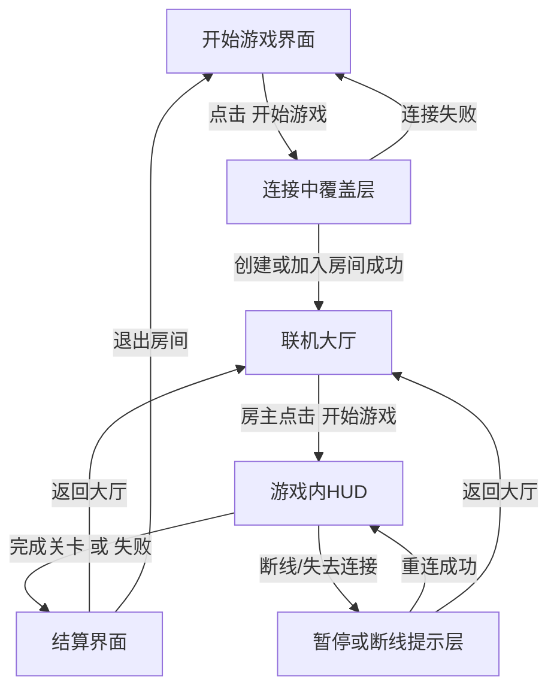
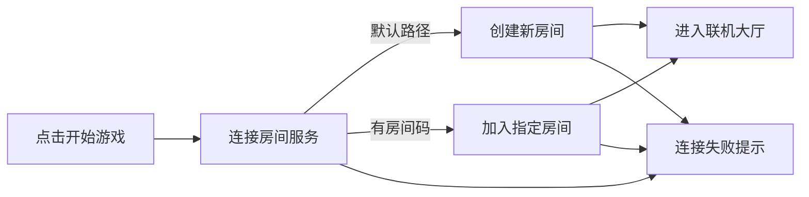
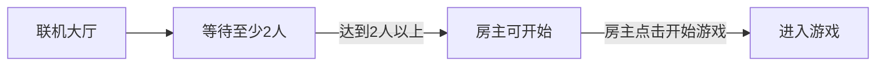

# 《废墟快递》界面跳转设计

> 版本：UI Flow Draft v0.1  
> 文档类型：界面流程设计  
> 适用范围：网页 Demo / 后续正式版可扩展  
> 对应文档：`GameDesignDocument.md`、`ImplementationSteps.md`

---

## 1. 文档目标

这份文档用于明确《废墟快递》当前版本中各个界面的切换逻辑、进入条件、退出条件和关键交互。

它要解决的问题是：

- 玩家启动游戏后先看到什么
- 如何进入房间
- 房间里玩家如何显示
- 谁可以开始游戏
- 断线、退出、连接失败时界面如何处理

这份文档先服务于 Demo，但结构要为后续正式版保留扩展空间。

---

## 2. 当前设计结论

当前版本的主界面流程定义为：

`开始游戏界面 -> 联机大厅 -> 游戏内 -> 结算/返回大厅`

其中：

- 联机大厅固定显示 `4 个玩家格子`
- 房主默认占据 `最左侧第 1 格`
- 后续加入的玩家依次占据 `第 2 / 第 3 / 第 4 格`
- 大厅界面右下角放置 `开始游戏`
- `开始游戏` 仅房主可点击
- Demo 阶段建议采用 `最少 2 人即可开始，最多 4 人`

这样既满足当前原型验证，也不妨碍后续扩成完整 4 人版本。

---

## 3. 设计原则

### 3.1 流程必须短

玩家从打开游戏到进入大厅，步骤要尽量少。  
不要在 Demo 阶段设计复杂入口、复杂账号体系或多层大厅树。

### 3.2 房间状态必须清晰

玩家必须一眼看懂：

- 自己是不是房主
- 当前房间有几个人
- 哪些格子是空的
- 还能不能开始

### 3.3 错误反馈必须前置

连接失败、房间不存在、房间已满、房主离开等情况必须有明确提示，不能静默失败。

### 3.4 开始按钮必须有明确权限

大厅右下角的 `开始游戏` 只属于房主操作。  
非房主玩家看到该按钮时应处于禁用状态，并显示“等待房主开始”。

---

## 4. 界面列表

当前版本界面建议拆成以下 6 个：

1. `开始游戏界面`
2. `连接中覆盖层`
3. `联机大厅`
4. `游戏内 HUD`
5. `暂停 / 断线提示层`
6. `结算界面`

---

## 5. 主流程图

---

## 6. 开始游戏界面

### 6.1 目标

作为游戏的第一入口，负责让玩家快速进入联机流程。

### 6.2 主要内容

- 游戏标题：`废墟快递`
- 副标题或一句话说明
- 主按钮：`开始游戏`
- 次按钮：`退出游戏` 或 `关闭页面`
- 右下角或底部信息：
  - 当前版本号
  - 网络状态提示

### 6.3 主要交互

点击 `开始游戏` 后，不直接进入正式关卡，而是先进入 `连接中覆盖层`。

### 6.4 设计理由

因为联机房间一定要先建立连接状态，所以开始界面只负责做一次明确的“进入联机”动作，不在这里塞太多分叉。

---

## 7. 连接中覆盖层

### 7.1 目标

用于承接从开始界面到联机大厅之间的网络连接过程。

### 7.2 显示内容

- 文案：`正在连接服务器...`
- 次级文案：`正在创建房间` 或 `正在加入房间`
- 简单 loading 动画
- 取消按钮：`返回`

### 7.3 推荐连接策略

当前 Demo 推荐采用下面的默认流程：

1. 玩家点击 `开始游戏`
2. 客户端先尝试连接房间服务
3. 若当前没有指定房间码，则默认执行：
   - `创建一个新的房间`
   - 创建者自动成为房主
4. 若玩家是通过邀请链接或房间码进入，则执行：
   - `尝试加入指定房间`

### 7.4 Demo 阶段推荐进房方案

为了让 Demo 足够简单，我建议采用双通道：

- 默认入口：
  - 点击 `开始游戏`
  - 直接创建新房间
- 补充入口：
  - 在开始界面增加一个较小的 `输入房间码` 入口
  - 允许好友通过房间码加入

这样用户第一次体验最顺，而组队测试时也有加入路径。

### 7.5 失败处理

如果连接失败：

- 弹出错误提示：
  - `服务器连接失败`
  - `房间不存在`
  - `房间已满`
- 提供两个按钮：
  - `重试`
  - `返回开始界面`

---

## 8. 联机大厅

### 8.1 目标

作为正式开局前的组织界面，让玩家完成“进入房间、看到队友、等待、开始”的流程。

### 8.2 基础布局

建议大厅结构如下：

- 左上：房间标题 / 房间码
- 中央：`4 个玩家格子`
- 右侧或底部：房间信息与提示
- 右下：`开始游戏`

### 8.3 玩家格子规则

联机大厅固定显示 `4 个格子`：

- `1 号格`
  - 房主进入房间后自动占据
  - 永远是最左边第一个格子
- `2 号格`
  - 第二位进入房间的玩家占据
- `3 号格`
  - 第三位进入房间的玩家占据
- `4 号格`
  - 第四位进入房间的玩家占据

空格子应明确显示：

- `等待玩家加入`
- `空位`
- 可附带淡化的人形占位图

### 8.4 每个格子的展示信息

每个玩家格子建议包含：

- 玩家昵称
- 房主标记
- 连接状态
- Ready 状态
- 角色预选状态（后续可加）

### 8.5 房间信息区

建议包含：

- 房间码
- 当前人数：`1/4`、`2/4`、`3/4`、`4/4`
- 最少开始人数：`2 人`
- 当前网络状态
- 系统提示：
  - `等待更多玩家加入`
  - `已满足开始条件`
  - `等待房主开始`

### 8.6 右下角开始游戏按钮

这是大厅中最重要的主按钮。

规则如下：

- 位置：`界面右下角`
- 文案：`开始游戏`
- 权限：只有房主可点击
- 状态分为 3 种：

1. `禁用`
   - 条件：当前人数不足 2 人
   - 文案提示：`至少需要 2 名玩家`

2. `可点击`
   - 条件：房主在房内，且人数达到开始条件
   - 结果：进入游戏内

3. `灰置不可点击`
   - 条件：当前玩家不是房主
   - 文案提示：`等待房主开始`

### 8.7 大厅中的其他按钮

建议同时提供：

- `复制房间码`
- `邀请好友`
- `离开房间`

其中：

- `离开房间`
  - 普通玩家离开：该格子清空，房间继续存在
  - 房主离开：需要触发房主转移或房间关闭逻辑

### 8.8 房主离开规则

Demo 阶段推荐简化成：

- 如果房主离开，房间直接关闭
- 所有玩家返回开始界面
- 弹出提示：`房主已离开，房间关闭`

正式版再考虑房主转移。

---

## 9. 游戏内 HUD

### 9.1 目标

在进入关卡后提供必要信息，但不抢占第一人称视野。

### 9.2 包含内容

- 当前目标提示
- 玩家人数
- 货物状态
- 关键交互提示
- 网络状态提示

### 9.3 与大厅的关系

从大厅点击 `开始游戏` 后，界面不应黑屏过久。  
建议流程是：

- 大厅点击 `开始游戏`
- 短暂 loading
- 进入关卡并显示 HUD

---

## 10. 暂停 / 断线提示层

### 10.1 目标

处理游戏中断线、服务端连接异常、玩家掉线等情况。

### 10.2 需要覆盖的情况

- 自己断线
- 队友断线
- 房主断线
- 服务端短暂不可用

### 10.3 文案建议

- `连接已中断，正在尝试重连...`
- `队友已离开房间`
- `房主已断开，房间即将关闭`

### 10.4 按钮建议

- `重试连接`
- `返回大厅`
- `返回开始界面`

---

## 11. 结算界面

### 11.1 目标

作为一局结束后的收束界面，给玩家明确结果，并把他们导回下一轮循环。

### 11.2 显示内容

- 本局结果：成功 / 失败
- 货物剩余状态
- 用时
- 简单评价

### 11.3 按钮建议

- `返回大厅`
- `再来一局`
- `退出房间`

### 11.4 跳转规则

- `返回大厅`
  - 回到原房间大厅
  - 保留当前房间玩家
- `再来一局`
  - 等价于回大厅并由房主再次点击开始
- `退出房间`
  - 回到开始界面

---

## 12. 详细状态机

### 12.1 房间进入逻辑

### 12.2 房间内开始逻辑

---

## 13. 推荐的 Demo 交互细节

### 13.1 最省事的 Demo 方案

如果优先考虑尽快落地，推荐：

- 开始界面只有一个主按钮：`开始游戏`
- 点击后默认 `创建房间`
- 创建成功后进入联机大厅
- 房间码显示在大厅左上
- 朋友通过 `房间码` 或链接加入

### 13.2 房间码建议

房间码可以使用：

- `4-6 位字母数字组合`
- 例如：`A7K2`

要求：

- 易读
- 易手动输入
- 不要太长

### 13.3 加入房间入口

建议在开始界面加一个次级入口：

- `加入房间`

点击后弹出一个简单输入框：

- 输入房间码
- 点击 `加入`

这样不会破坏“开始游戏”的简洁性，也满足测试联机场景。

---

## 14. 错误处理表

| 场景 | 提示文案 | 玩家可执行操作 |
|------|----------|----------------|
| 服务器连接失败 | 无法连接服务器 | 重试 / 返回开始界面 |
| 房间不存在 | 房间码无效或房间已关闭 | 重新输入 / 返回开始界面 |
| 房间已满 | 当前房间人数已满 | 返回开始界面 |
| 房主离开 | 房主已离开，房间关闭 | 返回开始界面 |
| 游戏中断线 | 连接中断，正在尝试恢复 | 等待重连 / 返回大厅 |

---

## 15. 当前建议的首版实现范围

为了让 Demo 尽快落地，首版只需要先实现：

1. `开始游戏界面`
2. `连接中覆盖层`
3. `联机大厅`
4. `游戏内 HUD`
5. `结算界面`

其中可以延后实现的内容：

- 复杂邀请系统
- 房主转移
- 服务器浏览
- 多语言切换
- 社交扩展

---

## 16. 最终建议

这版网页 Demo 的界面流程应该优先做到：

- 启动后能快速进房
- 进房后能一眼看懂房间状态
- 房主能明确开始游戏
- 普通玩家能明确自己在等什么
- 出错时能明确知道下一步怎么办

也就是说，界面设计优先级不是“酷炫”，而是：

`短路径 + 强状态可读性 + 明确权限 + 明确错误反馈`

只要这四点成立，这套 UI 流程就足以支撑当前 Demo。
