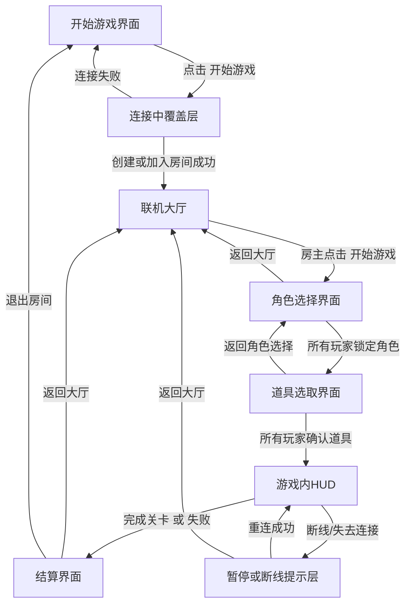
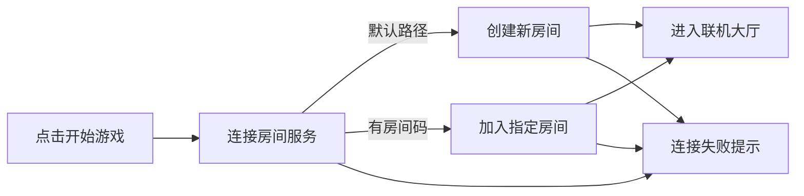
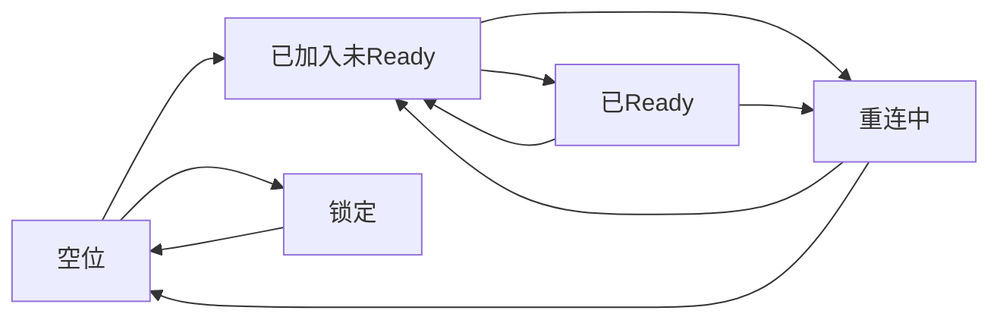

# 《废墟快递》界面跳转设计

> 版本：UI Flow Draft v0.1  
> 文档类型：界面流程设计  
> 适用范围：网页 Demo / 后续正式版可扩展  
> 对应文档：`GameDesignDocument.md`、`ImplementationSteps.md`

---

## 1. 文档目标

这份文档用于明确《废墟快递》当前版本中各个界面的切换逻辑、进入条件、退出条件和关键交互。

它要解决的问题是：

- 玩家启动游戏后先看到什么
- 如何进入房间
- 房间里玩家如何显示
- 谁可以开始游戏
- 断线、退出、连接失败时界面如何处理

这份文档先服务于 Demo，但结构要为后续正式版保留扩展空间。

---

## 2. 当前设计结论

当前版本的主界面流程定义为：

`开始游戏界面 -> 联机大厅 -> 角色选择 -> 道具选取 -> 游戏内 -> 结算/返回大厅`

其中：

- 联机大厅固定显示 `4 个玩家格子`
- 房主默认占据 `最左侧第 1 格`
- 后续加入的玩家依次占据 `第 2 / 第 3 / 第 4 格`
- 房间支持 `2 / 3 / 4 人上限`
- 未开放的格子显示为 `锁定`
- 大厅界面右下角放置 `开始游戏`
- `开始游戏` 仅房主可点击
- 房主点击 `开始游戏` 后，不直接进入关卡，而是进入 `角色选择`
- 当前版本角色选择只支持 `搬运工` 与 `跑腿小哥`
- 所有玩家完成角色锁定后，进入 `道具选取`
- 道具选取阶段中，玩家从 `公共池` 选择 `1-2 件道具`
- 所有玩家完成道具确认后，房主才可以正式进入游戏

这样既满足当前原型验证，也不妨碍后续扩成完整 4 人版本。

---

## 3. 设计原则

### 3.1 流程必须短

玩家从打开游戏到进入大厅，步骤要尽量少。  
不要在 Demo 阶段设计复杂入口、复杂账号体系或多层大厅树。

### 3.2 房间状态必须清晰

玩家必须一眼看懂：

- 自己是不是房主
- 当前房间有几个人
- 哪些格子是空的
- 还能不能开始

### 3.3 错误反馈必须前置

连接失败、房间不存在、房间已满、房主离开等情况必须有明确提示，不能静默失败。

### 3.4 开始按钮必须有明确权限

大厅右下角的 `开始游戏` 只属于房主操作。  
非房主玩家看到该按钮时应处于禁用状态，并显示“等待房主开始”。

---

## 4. 界面列表

当前版本界面建议拆成以下 8 个：

1. `开始游戏界面`
2. `连接中覆盖层`
3. `联机大厅`
4. `角色选择界面`
5. `道具选取界面`
6. `游戏内 HUD`
7. `暂停 / 断线提示层`
8. `结算界面`

---

## 5. 主流程图

---

## 6. 开始游戏界面

### 6.1 目标

作为游戏的第一入口，负责让玩家快速进入联机流程。

### 6.2 主要内容

- 游戏标题：`废墟快递`
- 副标题或一句话说明
- 主按钮：`开始游戏`
- 次按钮：`退出游戏` 或 `关闭页面`
- 右下角或底部信息：
  - 当前版本号
  - 网络状态提示

### 6.3 主要交互

点击 `开始游戏` 后，不直接进入正式关卡，而是先进入 `连接中覆盖层`。

### 6.4 设计理由

因为联机房间一定要先建立连接状态，所以开始界面只负责做一次明确的“进入联机”动作，不在这里塞太多分叉。

---

## 7. 连接中覆盖层

### 7.1 目标

用于承接从开始界面到联机大厅之间的网络连接过程。

### 7.2 显示内容

- 文案：`正在连接服务器...`
- 次级文案：`正在创建房间` 或 `正在加入房间`
- 简单 loading 动画
- 取消按钮：`返回`

### 7.3 推荐连接策略

当前 Demo 推荐采用下面的默认流程：

1. 玩家点击 `开始游戏`
2. 客户端先尝试连接房间服务
3. 若当前没有指定房间码，则默认执行：
   - `创建一个新的房间`
   - 创建者自动成为房主
4. 若玩家是通过邀请链接或房间码进入，则执行：
   - `尝试加入指定房间`

### 7.4 Demo 阶段推荐进房方案

为了让 Demo 足够简单，我建议采用双通道：

- 默认入口：
  - 点击 `开始游戏`
  - 直接创建新房间
- 补充入口：
  - 在开始界面增加一个较小的 `输入房间码` 入口
  - 允许好友通过房间码加入

这样用户第一次体验最顺，而组队测试时也有加入路径。

### 7.5 房间创建默认参数

为了保证大厅逻辑完整，创建房间时需要生成以下基础参数：

- 房间类型：`私人房`
- 房间人数上限：默认 `4 人`
- 最少开始人数：`2 人`
- 房主：创建者
- 房间状态：`大厅中`
- 房间码：自动生成
- 中途加入：Demo 阶段默认 `关闭`

### 7.6 人数上限调整

房主在大厅中可以修改房间人数上限：

- `2 人`
- `3 人`
- `4 人`

规则如下：

- 只有在 `未开始游戏` 时可调整
- 如果当前房间人数已经超过目标上限，则不能降低
- 超出上限的格子显示为 `锁定`
- 调整后要立即同步到所有玩家界面

### 7.7 失败处理

如果连接失败：

- 弹出错误提示：
  - `服务器连接失败`
  - `房间不存在`
  - `房间已满`
- 提供两个按钮：
  - `重试`
  - `返回开始界面`

---

## 8. 联机大厅

### 8.1 目标

作为正式开局前的组织界面，让玩家完成“进入房间、看到队友、等待、开始”的流程。

### 8.2 基础布局

建议大厅结构如下：

- 左上：房间标题 / 房间码
- 中央：`4 个玩家格子`
- 右侧或底部：房间信息与提示
- 左下或右侧底部：功能按钮区
- 右下：`开始游戏`

### 8.3 玩家格子规则

联机大厅固定显示 `4 个格子`：

- `1 号格`
  - 房主进入房间后自动占据
  - 永远是最左边第一个格子
- `2 号格`
  - 第二位进入房间的玩家占据
- `3 号格`
  - 第三位进入房间的玩家占据
- `4 号格`
  - 第四位进入房间的玩家占据

空格子应明确显示：

- `等待玩家加入`
- `空位`
- 可附带淡化的人形占位图

如果当前房间上限不足 4 人，则多余格子显示：

- `锁定`
- `当前房间未开放`

### 8.3.1 格子状态定义

每个格子需要支持以下状态：

- `空位`
  - 当前没有玩家占据
- `已加入 / 未准备`
  - 玩家已经在房内，但未 Ready
- `已准备`
  - 玩家已 Ready，等待开始
- `重连中`
  - 玩家临时断线，但保留席位
- `锁定`
  - 当前房间上限不足，不开放该格子

这样无论房间是 2 人、3 人还是 4 人，界面都能维持统一布局。

### 8.4 每个格子的展示信息

每个玩家格子建议包含：

- 玩家昵称
- 房主标记
- 连接状态
- Ready 状态
- 角色预选状态（大厅内只显示摘要，正式选择在下一界面完成）
- 当前延迟图标（后续可简化为颜色）
- 断线倒计时（仅重连中时显示）

### 8.4.1 玩家格子推荐附加交互

房主视角下，每个其他玩家格子可补充：

- `踢出玩家`
- `查看连接状态`

普通玩家视角下，不显示管理按钮。

### 8.5 房间信息区

建议包含：

- 房间码
- 当前人数：`1/4`、`2/4`、`3/4`、`4/4`
- 房间上限：`2 人` / `3 人` / `4 人`
- 最少开始人数：`2 人`
- 当前网络状态
- 当前房主名称
- 系统提示：
  - `等待更多玩家加入`
  - `等待所有玩家 Ready`
  - `已满足开始条件`
  - `等待房主开始`

### 8.5.1 大厅中的 Ready 逻辑

联机大厅需要一个明确的 `Ready / 取消 Ready` 系统。

规则建议如下：

- 所有玩家进入大厅后默认 `未准备`
- 每位玩家都要手动点击 `Ready`
- 房主也必须 Ready，不能跳过
- 只要有人更换角色、调整房间人数上限或重新加入，系统可选择自动取消该玩家的 Ready

推荐开始前置条件：

1. 房间人数达到至少 `2 人`
2. 所有已加入玩家均为 `Ready`
3. 没有玩家处于 `重连中`
4. 房间状态仍为 `大厅中`

### 8.6 右下角开始游戏按钮

这是大厅中最重要的主按钮。

规则如下：

- 位置：`界面右下角`
- 文案：`开始游戏`
- 权限：只有房主可点击
- 状态分为 3 种：

1. `禁用`
   - 条件：人数不足 2 人，或仍有玩家未 Ready，或有人处于重连中
   - 文案提示：
     - `至少需要 2 名玩家`
     - `等待所有玩家 Ready`
     - `有玩家正在重连`

2. `可点击`
   - 条件：房主在房内，且满足全部开始条件
   - 结果：进入角色选择界面

3. `灰置不可点击`
   - 条件：当前玩家不是房主
   - 文案提示：`等待房主开始`

### 8.7 大厅中的其他按钮

建议同时提供：

- `Ready / 取消 Ready`
- `复制房间码`
- `邀请好友`
- `调整人数上限`
- `离开房间`

其中：

- `离开房间`
  - 普通玩家离开：该格子清空，房间继续存在
  - 房主离开：需要触发房主转移或房间关闭逻辑

### 8.8 房主离开规则

为了支持更稳定的 2-4 人联机，建议不再直接关闭房间，而是使用房主转移逻辑：

1. 如果房主离开且房内还有其他玩家：
   - 将房主转移给当前房间中进入最早、仍在线的下一名玩家
   - 原 1 号格的房主标记切换到新房主
   - 系统提示：`房主已离开，房主已转移给 XXX`

2. 如果房主离开且房内无人剩余：
   - 房间关闭
   - 返回开始界面

### 8.9 断线重连逻辑

为了支持 2-4 人联机稳定性，大厅必须具备席位保留机制。

建议规则如下：

- 玩家断线后，不立即清空格子
- 该格子进入 `重连中`
- 保留原昵称、角色、Ready 状态和格子位置
- 显示 `重连剩余时间`，例如 `20 秒`

如果玩家在时限内重连成功：

- 回到原格子
- 恢复原状态
- 系统提示：`XXX 已重新连接`

如果玩家在时限内未重连：

- 格子清空
- 若该玩家是房主，则执行房主转移逻辑

### 8.10 大厅中的开始后状态

房主点击 `开始游戏` 后，大厅要进入一个短暂的 `开局锁定状态`：

- 锁定 Ready 按钮
- 锁定房间人数上限调整
- 锁定邀请与踢人功能
- 显示提示：`正在进入角色选择...`

这样可以避免在加载过渡时出现房间状态错乱。

---

## 9. 角色选择界面

### 9.1 目标

在正式进入关卡前，让每一位玩家明确选择并锁定自己的角色。

### 9.2 当前版本支持的角色

当前版本只支持两个角色：

- `搬运工 (Heavy Lifter)`
- `跑腿小哥 (Runner)`

不显示其他未开放职业，避免让玩家误以为当前 Demo 已支持更多职业。

### 9.3 进入条件

只有在以下条件成立时，才能从联机大厅进入角色选择界面：

- 房间人数至少 `2 人`
- 所有已加入玩家都已 `Ready`
- 没有人处于 `重连中`
- 房主点击了 `开始游戏`

### 9.4 基础布局

建议角色选择界面布局如下：

- 左上：房间标题 / 返回大厅
- 中央：当前玩家列表
- 中部主区域：`两个角色卡片`
- 右侧或底部：角色说明 / 已选人数
- 右下：`锁定角色` 或 `进入游戏`

### 9.5 角色卡片内容

每个角色卡片至少展示：

- 角色名称
- 角色定位
- 关键特性
- 适用职责
- 当前是否已被其他玩家选择

当前 Demo 建议的展示文案：

- `搬运工`
  - 更重、更稳、更适合扛货
  - 无法被当前版本的投石车稳定发射过裂隙
- `跑腿小哥`
  - 更轻、更快、更适合跨隙先行
  - 可以被投石车发射到裂隙对岸

### 9.6 选择规则

当前版本建议采用：

- `角色唯一占用`
- 一个房间内同一角色默认只能被一名玩家选择

这样可以强制形成：

- 一名 `搬运工`
- 一名 `跑腿小哥`

对于 3-4 人房间，Demo 阶段建议规则为：

- 先允许重复选择
- 但必须至少有一名 `搬运工` 和一名 `跑腿小哥`

这样既支持 2-4 人房间，又不会让当前 Demo 因角色数量不足而卡住。

### 9.7 锁定规则

角色选择界面需要一个明确的 `锁定角色` 机制。

规则如下：

- 玩家点击角色卡片后，仅表示 `选中`
- 玩家点击 `锁定角色` 后，才真正提交
- 锁定后角色卡片进入不可修改状态
- 若房主还未开始关卡，允许玩家点击 `取消锁定`

### 9.8 房主权限

房主在角色选择界面中拥有：

- 看到所有玩家是否已完成锁定
- 在所有玩家完成锁定后点击 `进入游戏`

非房主看到的主按钮状态：

- 若自己未锁定：`锁定角色`
- 若自己已锁定但其他人未锁定：`等待其他玩家`
- 若所有人都锁定：`等待房主进入游戏`

### 9.9 默认选择建议

为了减少等待时间，建议在进入角色选择界面时：

- 房主默认高亮 `搬运工`
- 第二位玩家默认高亮 `跑腿小哥`
- 但仍需要玩家自己点击 `锁定角色`

### 9.10 冲突处理

如果两个玩家同时尝试锁定同一个唯一角色：

- 先提交成功的一方占用该角色
- 后提交者收到提示：`该角色已被其他玩家锁定`
- 后提交者需要重新选择

### 9.11 返回规则

角色选择界面中建议提供 `返回大厅`：

- 仅房主可主动返回大厅
- 房主返回大厅后，所有玩家一起返回
- 返回大厅后，所有玩家的角色锁定状态清空

### 9.12 角色选择完成条件

只有满足以下条件，才能进入道具选取：

1. 所有玩家都已锁定角色
2. 至少存在一名 `搬运工`
3. 至少存在一名 `跑腿小哥`
4. 没有玩家处于断线重连中
5. 房主点击 `进入道具选取`

---

## 10. 道具选取界面

### 10.1 目标

在正式进入关卡前，让玩家从一个公共池中完成本局携带道具的分配，形成明确的开局准备与协作分工。

### 10.2 基本规则

道具选取界面采用 `公共池共享选择`：

- 房间内所有玩家看到同一个道具池
- 每位玩家必须选择 `1-2 件道具`
- 玩家最终携带的道具会跟随其角色进入关卡
- 房主只有在所有玩家都完成确认后，才能点击 `进入游戏`

### 10.3 基础布局

建议道具选取界面布局如下：

- 左上：房间标题 / 返回角色选择
- 中央上部：全队玩家列表与各自已选道具
- 中央主区域：`公共道具池`
- 右侧：当前道具详情 / 剩余数量 / 推荐搭配
- 右下：`确认道具` 或 `进入游戏`

### 10.4 公共池展示信息

每个道具卡片至少展示：

- 道具名称
- 道具图标
- 核心用途
- 剩余数量
- 当前被谁选中
- 是否与当前角色匹配

### 10.5 当前 Demo 推荐道具池

为了保证当前原型能支撑裂隙协作与基础搬运，建议公共池先放以下道具：

- `毛毯`
  - 用于接住跨越裂隙抛出的货物
  - 建议库存：`1`
- `购物车`
  - 用于提高平地搬运效率
  - 建议库存：`1`
- `稳定绑带`
  - 降低搬运过程中的货物晃动或掉落风险
  - 建议库存：`2`
- `应急缓冲垫`
  - 在失误时减少一次货物状态损失或跌落惩罚
  - 建议库存：`2`

说明：

- `发射器（投石车）` 属于关卡交互装置，不进入公共池
- 首版公共池优先服务 `裂隙协作` 与 `货物保护`

### 10.6 选取规则

推荐采用如下规则：

- 玩家点击道具卡片后，将其加入自己的已选栏
- 每名玩家至少选择 `1 件`
- 每名玩家最多选择 `2 件`
- 若某个道具库存耗尽，则其他玩家不可再选
- 若玩家已选满 `2 件`，则必须先取消一件，才能改选其他道具

### 10.7 队伍约束

为了保证当前 Demo 的裂隙流程可完成，建议加入以下开局约束：

- 全队至少携带 `1 件毛毯`
- 所有玩家都必须完成道具确认
- 没有玩家处于 `重连中`

这样可以避免队伍直接带着不完整配置进入一个无法完成的关卡。

### 10.8 角色与道具的推荐关系

为了提升可读性，建议界面中显示软性推荐：

- `跑腿小哥`
  - 优先推荐：`毛毯`
  - 次推荐：`应急缓冲垫`
- `搬运工`
  - 优先推荐：`购物车`
  - 次推荐：`稳定绑带`

这类推荐只做提示，不强制绑定。

### 10.9 确认规则

道具选取界面需要一个明确的 `确认道具` 机制。

规则如下：

- 玩家完成选择后点击 `确认道具`
- 确认后默认不可修改
- 若房主尚未进入游戏，可允许玩家点击 `取消确认`
- 任意玩家改动选择后，应自动取消自己的确认状态

### 10.10 房主权限

房主在道具选取界面中拥有：

- 查看所有玩家是否完成道具确认
- 在所有玩家确认后点击 `进入游戏`
- 在必要时返回 `角色选择界面`

非房主看到的主按钮状态：

- 若自己尚未确认：`确认道具`
- 若自己已确认但队友未确认：`等待其他玩家`
- 若全员都已确认：`等待房主进入游戏`

### 10.11 返回规则

道具选取界面中建议提供 `返回角色选择`：

- 仅房主可主动返回
- 房主返回后，所有玩家一起回到 `角色选择界面`
- 返回后清空全部道具选择与确认状态
- 已锁定的角色默认保留，除非玩家主动修改

### 10.12 道具选取完成条件

只有满足以下条件，才能进入游戏：

1. 所有玩家都已确认道具
2. 每位玩家都已选择 `1-2 件道具`
3. 全队至少携带 `1 件毛毯`
4. 没有玩家处于断线重连中
5. 房主点击 `进入游戏`

---

## 11. 游戏内 HUD

### 11.1 目标

在进入关卡后提供必要信息，但不抢占第一人称视野。

### 11.2 包含内容

- 当前目标提示
- 玩家人数
- 货物状态
- 关键交互提示
- 网络状态提示

### 11.3 与前置流程的关系

从道具选取点击 `进入游戏` 后，界面不应黑屏过久。  
建议流程是：

- 大厅点击 `开始游戏`
- 进入角色选择并完成锁定
- 进入道具选取并完成确认
- 房主点击 `进入游戏`
- 短暂 loading
- 进入关卡并显示 HUD

---

## 12. 暂停 / 断线提示层

### 12.1 目标

处理游戏中断线、服务端连接异常、玩家掉线等情况。

### 12.2 需要覆盖的情况

- 自己断线
- 队友断线
- 房主断线
- 服务端短暂不可用
- 房主转移

### 12.3 文案建议

- `连接已中断，正在尝试重连...`
- `队友已离开房间`
- `房主已离开，房主已转移给新的玩家`
- `房主已断开，正在处理房间状态`

### 12.4 按钮建议

- `重试连接`
- `返回大厅`
- `返回开始界面`

---

## 13. 结算界面

### 13.1 目标

作为一局结束后的收束界面，给玩家明确结果，并把他们导回下一轮循环。

### 13.2 显示内容

- 本局结果：成功 / 失败
- 货物剩余状态
- 用时
- 简单评价

### 13.3 按钮建议

- `返回大厅`
- `再来一局`
- `退出房间`

### 13.4 跳转规则

- `返回大厅`
  - 回到原房间大厅
  - 保留当前房间玩家
- `再来一局`
  - 等价于回大厅并由房主重新完成开始流程
- `退出房间`
  - 回到开始界面

---

## 14. 详细状态机

### 14.1 房间进入逻辑

### 14.2 房间内开始逻辑

```mermaid
flowchart LR
    lobbyState[联机大厅]
    waitPlayers[等待至少2人]
    waitReady[等待全员Ready]
    reconnectCheck[确认无人重连]
    hostCanStart[房主可进入角色选择]
    roleSelectState[角色选择界面]
    roleLockCheck[确认全员锁定角色]
    itemSelectState[道具选取界面]
    itemConfirmCheck[确认全员完成道具确认]
    gameLoading[进入游戏]

    lobbyState --> waitPlayers
    waitPlayers -->|达到2人以上| waitReady
    waitReady -->|全员Ready| reconnectCheck
    reconnectCheck -->|无人重连| hostCanStart
    hostCanStart -->|房主点击开始游戏| roleSelectState
    roleSelectState -->|全员已锁定角色| roleLockCheck
    roleLockCheck -->|房主点击进入道具选取| itemSelectState
    itemSelectState -->|全员已确认道具| itemConfirmCheck
    itemConfirmCheck -->|房主点击进入游戏| gameLoading
```

### 14.3 大厅席位状态机

---

## 15. 推荐的 Demo 交互细节

### 15.1 最省事的 Demo 方案

如果优先考虑尽快落地，推荐：

- 开始界面只有一个主按钮：`开始游戏`
- 点击后默认 `创建房间`
- 创建成功后进入联机大厅
- 房间码显示在大厅左上
- 朋友通过 `房间码` 或链接加入
- 房主点击开始游戏后进入角色选择
- 两名玩家分别锁定 `搬运工` 与 `跑腿小哥`
- 然后进入公共池道具选取
- 每位玩家选择 `1-2 件道具` 并完成确认
- 房主再点击进入游戏

### 15.2 房间码建议

房间码可以使用：

- `4-6 位字母数字组合`
- 例如：`A7K2`

要求：

- 易读
- 易手动输入
- 不要太长

### 15.3 加入房间入口

建议在开始界面加一个次级入口：

- `加入房间`

点击后弹出一个简单输入框：

- 输入房间码
- 点击 `加入`

这样不会破坏“开始游戏”的简洁性，也满足测试联机场景。

---

## 16. 角色选择错误处理

| 场景 | 提示文案 | 玩家可执行操作 |
|------|----------|----------------|
| 角色已被锁定 | 该角色已被其他玩家锁定 | 重新选择 |
| 玩家未锁定角色 | 请先锁定角色 | 继续选择 |
| 队伍缺少关键角色 | 队伍至少需要一名搬运工和一名跑腿小哥 | 调整角色配置 |
| 玩家重连中 | 有玩家正在重连，暂时无法进入游戏 | 等待 |

---

## 17. 道具选取错误处理

| 场景 | 提示文案 | 玩家可执行操作 |
|------|----------|----------------|
| 道具库存不足 | 该道具已被选完 | 改选其他道具 |
| 玩家未选满最低数量 | 请至少选择 1 件道具 | 继续选择 |
| 玩家超过上限 | 每位玩家最多只能携带 2 件道具 | 取消一件后再选择 |
| 队伍缺少关键道具 | 队伍至少需要携带 1 件毛毯 | 调整队伍配置 |
| 玩家未确认道具 | 请先确认道具配置 | 继续确认 |

---

## 18. 错误处理表

| 场景 | 提示文案 | 玩家可执行操作 |
|------|----------|----------------|
| 服务器连接失败 | 无法连接服务器 | 重试 / 返回开始界面 |
| 房间不存在 | 房间码无效或房间已关闭 | 重新输入 / 返回开始界面 |
| 房间已满 | 当前房间人数已满 | 返回开始界面 |
| 房主离开但房内仍有人 | 房主已离开，房主已转移 | 继续留在大厅 |
| 房主离开且房内无人 | 房主已离开，房间关闭 | 返回开始界面 |
| 玩家断线 | 玩家正在重连 | 等待 / 继续留在大厅 |
| 玩家重连超时 | 玩家已离开房间 | 继续留在大厅 |
| 游戏中断线 | 连接中断，正在尝试恢复 | 等待重连 / 返回大厅 |

---

## 19. 当前建议的首版实现范围

为了让 Demo 尽快落地，首版只需要先实现：

1. `开始游戏界面`
2. `连接中覆盖层`
3. `联机大厅`
4. `角色选择界面`
5. `道具选取界面`
6. `游戏内 HUD`
7. `结算界面`

其中可以延后实现的内容：

- 复杂邀请系统
- 服务器浏览
- 多语言切换
- 社交扩展

---

## 20. 最终建议

这版网页 Demo 的界面流程应该优先做到：

- 启动后能快速进房
- 进房后能一眼看懂房间状态
- 开局前能明确完成角色和道具分工
- 房主能明确开始游戏
- 普通玩家能明确自己在等什么
- 出错时能明确知道下一步怎么办

也就是说，界面设计优先级不是“酷炫”，而是：

`短路径 + 强状态可读性 + 明确权限 + 明确错误反馈`

只要这四点成立，这套 UI 流程就足以支撑当前 Demo。
